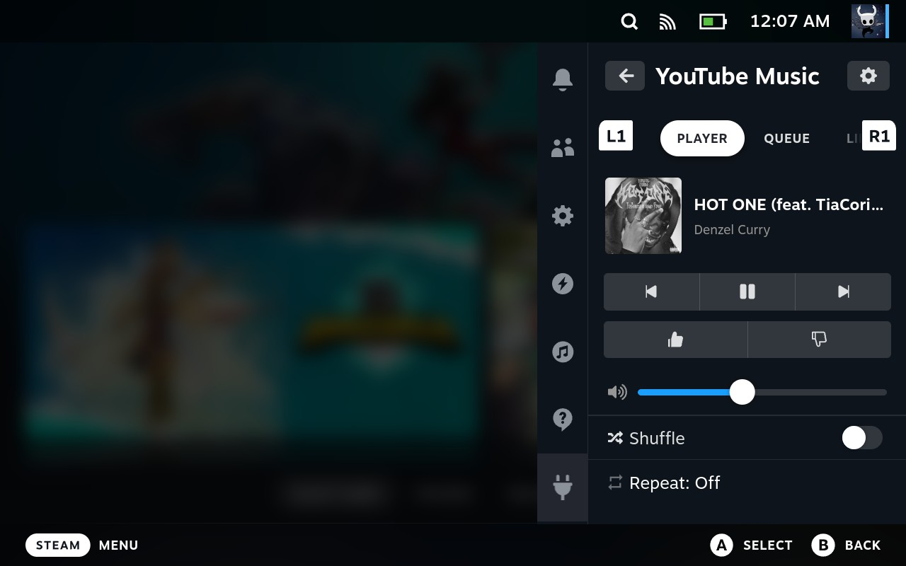
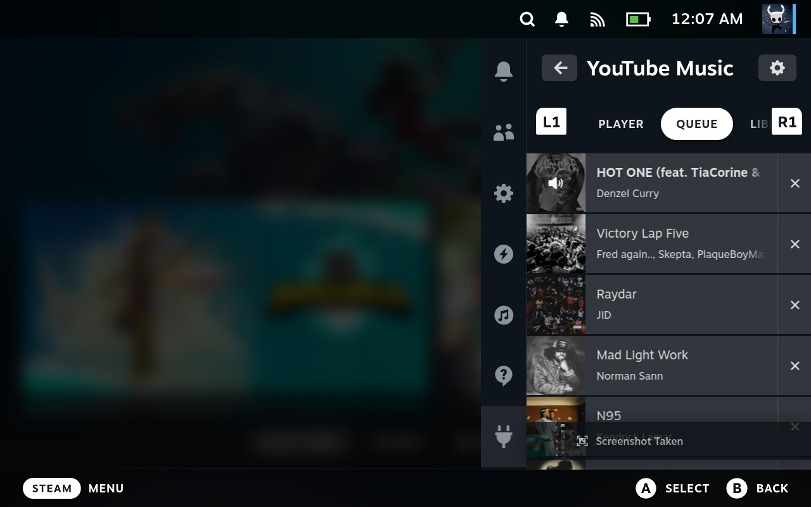
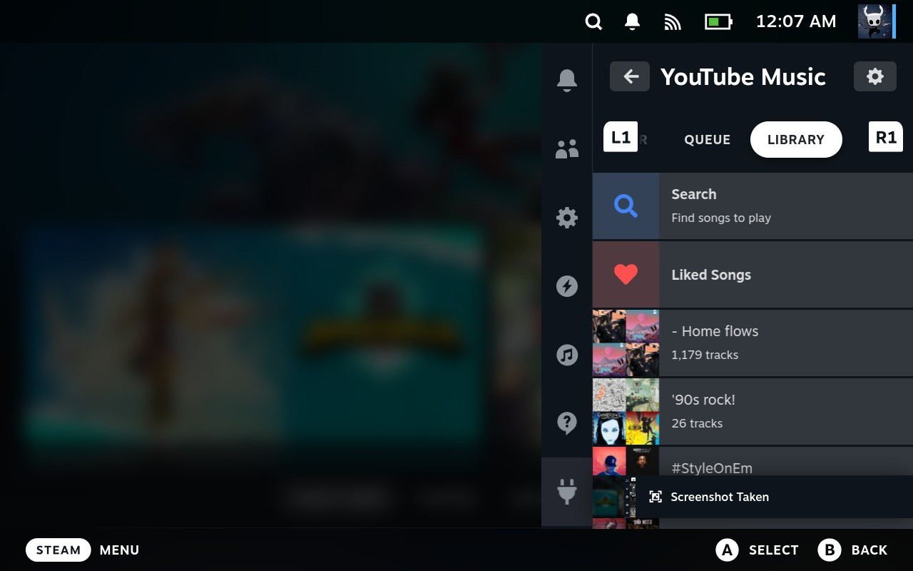

# YouTube Music Player for Decky

Play YouTube Music directly on your Steam Deck — no external app required. Built for [Decky Loader](https://decky.xyz/).

## Features

- **Standalone playback** — plays YouTube Music directly on your Steam Deck, no desktop app needed
- **Player controls** — play, pause, skip, previous
- **Album art & track info** — see what's playing at a glance
- **Like / Dislike** — rate songs directly from the player
- **Volume slider** — adjust volume directly
- **Shuffle & Repeat** — toggle shuffle and cycle repeat modes (Off / All / One)
- **Queue management** — view your queue, jump to tracks, or remove them
- **Library** — browse and play your playlists and Liked Songs
- **Search** — find songs and start a radio based on your selection
- **L1/R1 tabs** — quickly switch between Player, Queue, and Library
- **Background playback** — music continues when the Quick Access panel is closed

## Requirements

- [Decky Loader](https://decky.xyz/) installed on your Steam Deck

## Installation

1. Download the latest `youtube-music-player.zip` from the [Releases](https://github.com/DesvoSoft/decky-youtube-music-player/releases) page
2. Open Decky on your Steam Deck
3. Go to the Decky settings (gear icon)
4. Enable Developer Options
5. Go to the Developer Section
6. Select **Install from ZIP**
7. Choose the downloaded `youtube-music-player.zip`

## Setup

You can authenticate with YouTube Music using **OAuth** (recommended) or **browser cookie auth** (fallback).

### Option A: OAuth (Recommended)

1. Go to Settings in the plugin
2. Enter your Google OAuth Client ID (create one at [Google Cloud Console](https://console.cloud.google.com/) — app type: "TVs and Limited Input devices")
3. Click **Sign in with Google**
4. A device code will appear on screen — go to **google.com/device** on your phone or PC
5. Enter the code and authorize the app
6. The plugin will detect the authorization and connect automatically

### Option B: Browser Cookie Auth

1. On your PC, open a browser and go to [music.youtube.com](https://music.youtube.com)
2. Log in to your Google account
3. Open Developer Tools (F12) and go to the **Network** tab
4. Click around in YouTube Music (e.g. click Library)
5. Find a POST request to `/browse` with status 200
6. Copy the request headers:
   - **Firefox**: Right-click the request > Copy > Copy Request Headers
   - **Chrome**: Click the request, scroll to "Request Headers", copy from `accept: */*` onward
7. Paste the headers into a text file and save it (e.g. `headers.txt`)
8. Transfer the file to your Steam Deck (USB, SCP, etc.)
9. Go to Settings → **Browser Auth (Advanced)**
10. Enter the file path and click **Load & Connect**

### Playing music

1. Go to the **Library** tab and select a playlist, or use **Search** to find a song
2. Music will start playing through your Steam Deck's speakers/headphones
3. Use the Player tab to control playback

## How It Works

- **ytmusicapi** handles authentication, library browsing, playlists, search, and song ratings
- **yt-dlp** extracts streaming URLs (handles YouTube's signature deciphering)
- **python-mpv + PipeWire** plays audio natively on SteamOS (no CEF browser overhead)
- All state is managed by the Python backend, so music continues playing even when the Quick Access panel is closed

## License

BSD-3-Clause
